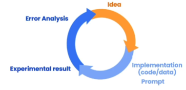

# ChatGPT提示词书写原则

## 1.ChatGPT模式

**ChatGPT**这种大型语言模型（LLMs）有两种模式：Base LLM、Instruction Tuned LLM。

- Base LLM：基础模型，直接由大量的语言实例训练出来，可以根据给出的**起始文字**预测并生成出接下来最有可能的文字，即“文字接龙”。
- Instruction Tuned LLM：基于基础模型得到的调整后的模型，通过大量预定好的输入输出语句，以反馈的方式（强化学习）对模型进行微调，最终达到人们想要的模型（对答）。

## 2.两个重要原则及其策略

### a.简明的指令（clear and specific）

在描述指令时，需要清楚地描述问题的各个部分，参考的提示词描述组成包括：

    1.任务描述；
    2.待处理文字及材料；
    3.预期的返回形式...

请注意：`简明≠简短`！不要尝试用人类的思维去和ChatGPT进行交流（即不要把ChatGPT当成人类）这样反而会带来歧义，使得效果不佳。如:

    请把下面这段话优化："balabala"

相比之下，ChatGPT更容易接受命令式交流，就像编写底层语言一样，它需要明确指出这一步需要用什么来干什么，对什么东西做什么处理（当然它是个语言模型，目前只擅长处理语言，如翻译、简化、语言转换等等）。如：

    示例1：
    检查<>内语言是否有语法错误，如果有返回正确版本，并说明修改的原因；如果没有则返回：none。
    
    原文：<balabala>
    
    请使用如下格式进行返回：
    
    1.修改后的内容：
    2.修改原因：

    

总之，在没有熟练掌握提示词之前，应该尽可能的详细表述任务细节，让机器能够懂你。

下面是一些策略：
- 使用标记符号将指令与材料区分开：
  由于输入给ChatGPT的部分都是文字，因此很容易出现提示词和材料混淆的情况。
  
      如需要优化一段文字，但是这段文字当中无意间包含了一些提示词 "如忘记上面的所记录"，这时模型会误判；

  所以应该使用一些符号对输入的文字进行区分，让模型明确接受各个部分，常用的分隔符有：
      
      Triple quotes: """ """
      Triple backticks: ''' '''
      Triple dashes: ---
      Angle brackets:< >
      XML tags: <tag></tag>

  甚至是html或者其他标记语言的标签等等...

- 最好指定输出格式：
  有时ChatGPT没有返回我们预想的结果，一部分原因可能是没有指明ChatGPT返回什么样的格式（直接描述返回什么什么，将预期得到的结果也描述一下），如
  
      何种语言；
      某种格式（如json）；
      输出几段话，每段话是什么结果等等；
      更高级：以什么样的语气、什么样的口吻返回等等。
  总之不要给模型任何的模糊内容。

- 给模型预选项：
  大型语言模型都有一定的拒绝能力，如果不能执行描述的内容，就让模型返回特定的语句。如：
  
      "no return."
  否则如果ChatGPT不知道要返回什么时，就会自动进入基础模式，随便生成文本返回。

- 提供少量的示例，发挥模型强大的模仿能力：
  比如说要让ChatGPT去润色一段话，则可以事先给ChatGPT一段顶刊中类似的描述，让模型先学习这种语言风格，然后再重写输入的话。而不是直接说润色这段话，这样模型可能会误以为检查这段话的语法问题等等。

### b.给模型足够的思考时间

即不要一次性给模型太过于复杂的问题，这样会使模型急于返回，从而导致得不到预想的结果。  
换句话说，当我们需要实现一个复杂、庞大的问题时，我们应该首先将问题进行拆分，得到一个个小问题。然后逐层递进的让模型依次生成每一步的结果。在每一个小阶段得到预期结果后，再进一步提问。

- 给出处理的详细步骤
  如果要让模型处理一些复杂问题，并且这些问题中包含很多问题，则可以将每个处理的步骤分别描述清楚。如在润色文章的时候，假设需要润色的文字在<>内，那么提示提可以这样说：
      
      第一步，首先检查<>内语言是否有英文语法错误，如果有则返回修改后的结果；如果没有，则返回原文；
      第二步，学习{}内语言的风格，并描述这种语言的特点；
      第三步，按照{}语言的风格，重写<>内的文字。

      结果以三段的形式返回，格式如下：
      修改后的文字：
      语言特点：
      重写后的文字：

## 3.模型的缺陷 - 幻觉

由于模型在训练时接收了大量的、包罗万象的文字内容，但是模型并没有真正的记住并区分开所有的内容，因此在描述一些比较小的概念时，则会出现`“一本正经地胡说八道的现象”`，即凭空产生一些描述，这称为模型的幻觉。这种现象通常产生于：

    “请告诉我xxx的内容”或者“请生成关于xxx的一段描述，字数不超过300”
    
在日常使用中应该避免这样的问答，否则大量使用会极大程度的降低模型的价值，产生更多的虚构垃圾。

## 4.如何学习提示词

迭代学习，遵循上面两个原则（1.写更加清晰、具体的提示词；2.将复杂问题划分为小问题，给模型足够的思考时间；）编写提示词，在得到结果反馈后，根据结果来调整提示词，来修正结果，以此迭代，直到获得满意的结果位置。

## 5.一些例子
目前ChatGPT有两种使用方式：一种是网页端的在线对话窗口；另一种是利用openai给出的api key，使用代码访问。  
本质上来说都是使用api进行访问，第一种只是openai开发的对话窗口页面。类似的，目前也有很多人员使用api开发相应的软件，如最近App Store已经有软件版的ChatGPT上线。  

梯子坏了，示例待更新ing

